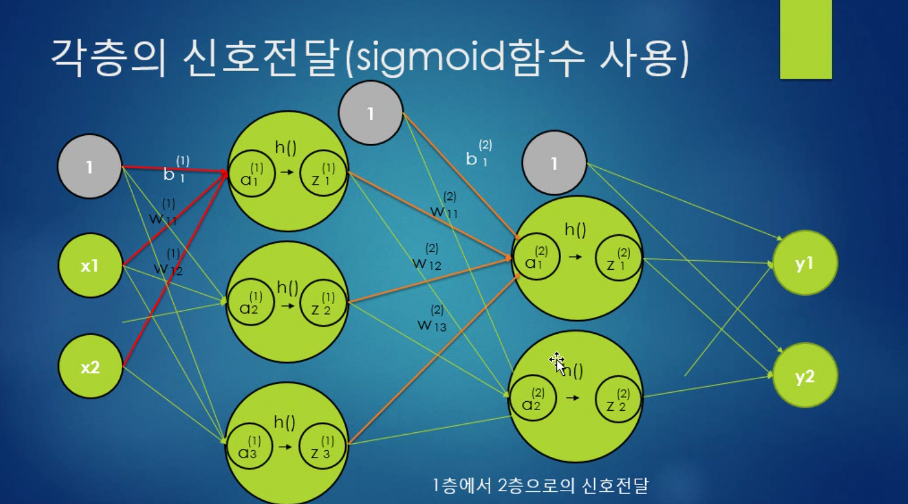

### ssafy_DNN
Deep learning study

# 1강~2강

### 퍼셉트론(인공뉴런) : 1957년에 고안된 알고리즘

### 퍼셉트론은 딥러닝(신경망)의 기원이 되는 알고리즘

### 퍼셉트론은 다수의 신호를 입력받아 하나의 신호를 출력한다.

### 여기서 신호는 전류나 물의 흐름을 생각해 볼 수 있다.

### 신호의 흐름을 표현할 때 두가지값을 갖는데 0,1의 값을 갖는다.
### 0은 안흐른다. 1은 신호가 흐른다.

[ 퍼셉트론 식 ]

w1 * x1 + w2 * x2 ≤  Ø
w1 * x1 + w2 * x2  > Ø

x1,x2는 압력신호, y는 출력신호, w1,w2는 가중치를 의미한다.
(w는 weight를 의미) Ø는 임계값

w1 * x1 + w2 * x2 값이 임계값 이하 일때는 0
아닐 때는 1

가중치가 클수록 해당신호가 강해진다

[ 논리 회로 ]

 * AND 게이트 진리표
 
|x1|x2|y|
|---|---|---|
|0|0|0|
|0|1|0|
|1|0|0|
|1|1|1|

입력이 모두 1일때만 1을 출력한다.

퍼셉트론으로 AND게이트를 표현하고자 할 때는 w1, w2, Ø 값을 어떤 값으로 설정할 것인지 생각해 봐야 한다.

AND게이트를 만족하는 w1,w2,Ø의 조합은 무수히 많다.

 * NAND 게이트 진리표
 
|x1|x2|y|
|---|---|---|
|0|0|1|
|0|1|1|
|1|0|1|
|1|1|0|

 * OR 게이트 진리표
 
|x1|x2|y|
|---|---|---|
|0|0|0|
|0|1|1|
|1|0|1|
|1|1|1|

퍼셉트론 표현할 때는 가중치와 임계값을 설정하여 표현할 수 있다.

이 매개변수의 값(w, Ø)을 적절히 조절하면 AND, NAND, OR 게이트를 표현 할 수 있다.

# 3강

[ 가중치와 편향을 도입한 퍼셉트론 식 ]

편향 : bias

 * 위의 퍼셉트론 식에서 Ø를 -b로 치환하면

w1 * x1 + w2 * x2 + b  으로 바꿔 줄 수 있다.

퍼셉트론은 입력신호에 가중치를 곱한 값과 편향을 합하여, 그 값이 0을 넘으면 1을 출력하고, 그렇지 않으면 0을 출력한다.

# 4강

 * XOR 게이트 진리표
|x1|x2|y|
|------|---|---|
|0|0|0|
|0|1|1|
|1|0|1|
|1|1|0|
 
 XOR 게이트는 배타적논리합이라고 한다
 x1과 x2 중 어느 한쪽이 1일 때만 1을 출력하는 논리회로
 
 퍼셉트론으로는 XOR 게이트를 구현 할 수 없다.
 
 직선 하나로는 XOR 게이트의 출력을 구분할 수 없다.(구분 불가능)
 
 퍼셉트론(단층 퍼셉트론)은 직선 하나로 나눈 영역만 표현할 수 있다는 한계가 있다.
 
 
 
 
 
 
 하지만 시간이 지나고 비선형 그래프로 XOR문제를 풀 수 있게 된다.
 
 다층 퍼셉트론을 사용하면 나눌 수 있게 된다.
 
 
 
 
 
 선형  : 직선의 영역을 선형 영역
 비선형 : 곡선의 영역을 비선형 영역
 
 
# 5강
 
 ### 다층 퍼셉트론(Multi Layer Perceptron)
 
 * 단층 퍼셉트론으로는 XOR게이트를 표현할 수 없다.
   즉, 단층 퍼셉트론으로는 비선형 영역을 분리할 수 없다.
 
 기존 게이트 (AND, OR, NAND) 조합하여 층을 쌓으면 XOR 게이트를 구현 할 수 있게 된다.
 
|x1|x2|s1|s2|y|
|---|---|---|---|---|
|0|0|1|0|0|
|0|1|1|1|1|
|1|0|1|1|1|
|1|1|0|1|0|

 
 
# 6강

퍼셉트론과 딥러닝의 차이는 -> 가중치를 스스로 학습을 통해 변경한다

### 신경망

입력층과 은닉층 출력층으로 이루어져 있다.

은닉층(사람 눈에 보이지 않는 층)은 중간층을 말한다.

입력층(0층), 은닉층(1층), 출력층(2층)은 앞시간에 배웠던 퍼셉트론의 신호전달 방식과 유사하다.(동일하다)
 
활성화 함수를 이용한 퍼셉트론 식

y = h(b + w1*x1 + w2*x2)

y = h(x) -> 활성화 함수.(0,1)의 값을 갖게 된다.

입력 신호의 총합을 출력신호로 변환하는 함수를 "활성화 함수" 라고 한다.

a = b + w1*x1 + w2*x2 (입력신호 총합)

y = h(a)

위의 식은 가중치가 있는 입력신호와 편향을 계산하고 이를 a 라고 하면 a를 함수 h()에 넣어 y를 출력하는 흐름을 보여준다.

[ 시그 모이드 함수 ]

신경망에서 자주 이용하는 활성화 함수 중의 하나이다.

h(x) = 1 / 1+e-x

# 7강

[ 계단 함수 ]
임계값을 경계로 출력이 바뀌는 함수

numpy.astype(np.int) 타입을 바꿔주는 함수.

# 8강

퍼셉트론에서는 활성화함수가 --> 계단함수 역할

딥러닝(신경망)에서는 활성화함수가 --> 시그모이드, 렐루 등등

### 계단함수와 시그모이드 함수의 공통점
 ** 비선형 함수: 직선하나로는 그릴 수 없는 함수
 
 따라서, 신경망에서는 활성화 함수로 비선형 함수를 사용해야 한다.
 
 만약 선형함수인 경우에는, 은닉층이없는 것과 같다. a = b3
 

[ ReLU 함수 ]

 - Rectified Linear Unit 함수 : 입력이 0이 넘으면 그 입력을 그대로 출력하고 0 이하이면 0을 출력하는 함수.
 
     h(x) = x (x가 0보다 크면)
            0 (x가 0보다 작으면)
            
            

# 9강

[ 행렬의 곱 (행렬의 내적) ]

 - 2차원 배열의 내적(행렬의 곱)
 
    * 행렬의 내적은 형상에 주의 해야 한다.
    
    행렬의 내적은 대응하는 차원의 원수 소를 일치 시켜야 한다.
    
    (n * p) • (p * m) ==> 일치해야함
    
    
# 10강

[ 신경망의 내적(가중치만 적용) ]

X = np.array([1,2]) # 입력신호
W = np.array([[1,3,5],[2,4,6]]) # 1,3,5는 x1의 가중치, 2,4,6은 x2의 가중치

Y = np.dot(X,W)

# 11강

활성화 함수를 사용하지 않은 경우.

# 12강

활성화 함수를 사용한 경우.

